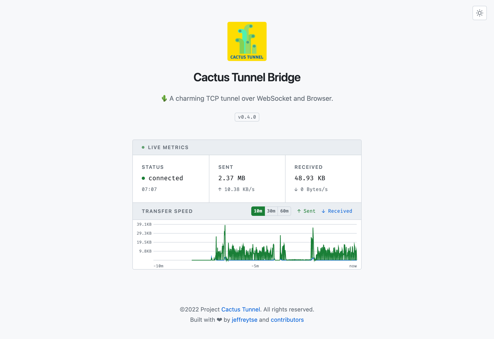

<div align="center">
  <br>

  <a href="https://github.com/jeffreytse/cactus-tunnel">
    
  </a>

  <h1>Cactus Tunnel</h1>

</div>

<h4 align="center">
  🌵 A charming TCP tunnel over WebSocket and Browser.
</h4>

<p align="center">
  <a href="https://github.com/jeffreytse/cactus-tunnel/actions/workflows/tests.yml">
    
  </a>

  <a href="https://badge.fury.io/js/cactus-tunnel">
    
  </a>

  <a href="https://opensource.org/licenses/MIT">
    
  </a>

  <a href="https://liberapay.com/jeffreytse">
    
  </a>

  <a href="https://patreon.com/jeffreytse">
    
  </a>

  <a href="https://ko-fi.com/jeffreytse">
  
  </a>
</p>

<div align="center">
  <sub>Built with ❤︎ by
  <a href="https://jeffreytse.net">jeffreytse</a> and
  <a href="https://github.com/jeffreytse/cactus-tunnel/graphs/contributors">contributors </a>
  </sub>
</div>

<br>

_Cactus Tunnel_ is a TCP tunnel tool over WebSocket and Browser. It can help
you open a TCP tunnel to another side of the world through the browser in an
extremely restricted environment, just like a cactus under the scorching sun
absorbing nutrients in the endless desert. **If you are a thirsty geek focused
on finding new hydration, don't miss it.**

<p align="center">
Like this charming tool? Give it a star or sponsor me!<br>
I will respect your crucial support and say THANK YOU!
</p>

<p align="center">
  
</p>

## Bridge Mode Web UI

In bridge mode, cactus-tunnel opens a live dashboard in your browser that acts
as the WebSocket relay and displays real-time transfer metrics.

<p align="center">
  
</p>

## Requirements

- Node.js >= 22

## Installation

Install from [npm](https://www.npmjs.com/package/cactus-tunnel):

```sh
npm install -g cactus-tunnel
```

## Usage

```sh
cactus-tunnel help
```

```
Usage: cactus-tunnel [options] [command]

TCP tunnel over websocket and browser

Options:
  -V, --version                       output the version number
  -h, --help                          display help for command

Commands:
  client [options] <server> <target>  runs cactus-tunnel in client mode
  server [options]                    runs cactus-tunnel in server mode
  help [command]                      display help for command
```

For the full CLI reference including all flags, defaults, and environment
variables, see [docs/cli.md](docs/cli.md).

### Tunnel Server

```sh
cactus-tunnel server
```

Listens on `0.0.0.0:7800` by default.

```sh
$ cactus-tunnel help server

Usage: cactus-tunnel server [options]

runs cactus-tunnel in server mode

Options:
  -p, --port <port>         tunnel server listening port (default: 7800)
  -h, --hostname <address>  tunnel server listening hostname (default: "0.0.0.0")
  -v, --verbose             enable verbose output
  --help                    display help for command
```

### Tunnel Client

```sh
$ cactus-tunnel help client

Usage: cactus-tunnel client [options] <server> <target>

runs cactus-tunnel in client mode

Arguments:
  server                            tunnel server url, empty is bridge mode, e.g.
                                    ws://your-tunnel-server:7800
  target                            tunnel target url, e.g. your-linux-ssh-server:22

Options:
  -p, --port <port>                 tunnel client listening port (default: 7700)
  -h, --hostname <address>          tunnel client listening hostname (default: "127.0.0.1")
  -b, --bridge-mode                 enable tunnel bridge mode
  -nb, --no-browser                 disable auto open browser when in bridge mode
  -bp, --bridge-port <port>         tunnel bridge listening port (default: 7900)
  -bh, --bridge-hostname <address>  tunnel bridge listening hostname (default: "0.0.0.0")
  -v, --verbose                     enable verbose output
  --help                            display help for command
```

### Request External API Services

Start a tunnel client in bridge mode:

```sh
cactus-tunnel client -b ws://<your-tunnel-server>:7800 ip-api.com:80
```

This starts a local server at `localhost:7700`, opens the bridge UI in the
browser, and tunnels traffic to `ip-api.com:80` via the tunnel server.

```sh
curl http://localhost:7700/json/8.8.8.8
```

When you connect to port `7700`, it auto-connects through the tunnel server
to `ip-api.com:80`. Response from the [IP API lookup service](https://ip-api.com/):

```sh
$ curl http://localhost:7700/json/8.8.8.8 | jq
{
  "status": "success",
  "country": "United States",
  "countryCode": "US",
  "region": "VA",
  "regionName": "Virginia",
  "city": "Ashburn",
  "zip": "20149",
  "lat": 39.03,
  "lon": -77.5,
  "timezone": "America/New_York",
  "isp": "Google LLC",
  "org": "Google Public DNS",
  "as": "AS15169 Google LLC",
  "query": "8.8.8.8"
}
```

### SSH SOCKS5 Proxy

Start a tunnel client in bridge mode:

```sh
cactus-tunnel client -b ws://<your-tunnel-server>:7800 <your-ssh-server>:22
```

Open an SSH SOCKS5 proxy through the tunnel:

```sh
ssh -p 7700 -D 3128 -C -N <your-username>@localhost
```

- `-D 3128`: open a SOCKS5 proxy on local port `3128`
- `-C`: compress data in the tunnel, save bandwidth
- `-N`: do not execute remote commands, useful for just forwarding ports

Configure your system or browser to use `localhost:3128` as a SOCKS5 proxy.

### Import the Package

```js
import cactusTunnel from "cactus-tunnel";

const server = new cactusTunnel.Server({
  listen: {
    port: 7800,
    hostname: "0.0.0.0",
  },
  logger: {
    silent: false,
  },
});

console.info("server listening at: http://0.0.0.0:7800");
```

## Development

Install dependencies:

```sh
npm install
```

Build and run tests:

```sh
npm test
```

Run the CLI from the built output:

```sh
npm run start:cli help
```

Edit source files under `src/`, `bin/`, and `tests/`. Rebuild with `npm run build` to pick up changes.

## Contributing

Issues and Pull Requests are greatly appreciated. If you've never contributed
to an open source project before I'm more than happy to walk you through how
to create a pull request.

Start by [opening an issue](https://github.com/jeffreytse/cactus-tunnel/issues/new)
describing the problem you'd like to resolve and we'll go from there.

## Credits

- [express](https://github.com/expressjs/express) - Fast, unopinionated, minimalist web framework for node.
- [websocket-stream](https://github.com/maxogden/websocket-stream) - WebSockets with the node stream API.
- [pump](https://github.com/mafintosh/pump) - Pipe streams together and close all of them if one of them closes.
- [winston](https://github.com/winstonjs/winston) - A logger for just about everything.

## License

This theme is licensed under the [MIT license](https://opensource.org/licenses/mit-license.php) © Jeffrey Tse.

<!-- External links -->
